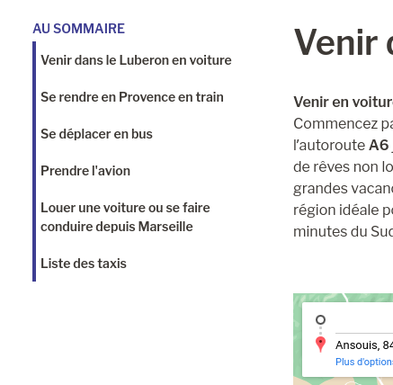

# Content Summary

A companion plugin for the [Luberon Sud Tourisme WordPress theme](https://github.com/JulienRevest/theme-luberon-sud)

This plugin generate a summary containing all the titles of a single page. The summary is clickable and will lead to the title, using anchors.

[Live example of a generated summary](https://www.luberon-sud-tourisme.fr/decouvrir-luberon-sud/comment-venir-voiture-train-bus/)

It reads the attributes of the `core/heading` block, to automatically read the anchor associated, and then generate an entry in the summary. The summary allows you to select the maximum level (h1, h2, h3...) that it should look for and create links to.